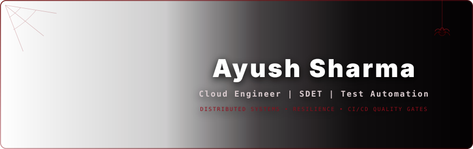
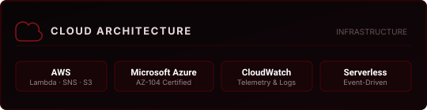
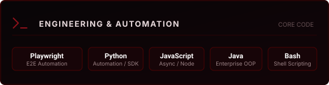
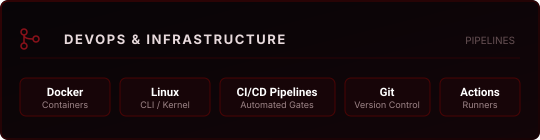
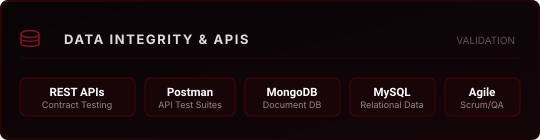
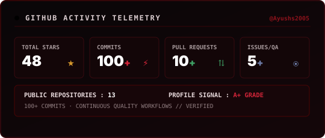
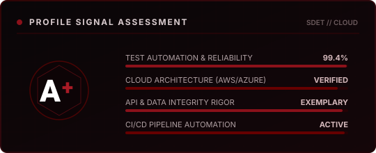
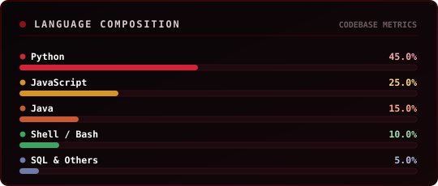

<!-- HERO ANIMATED VIDEO BANNER (CRISP & ADJUSTED ASPECT RATIO) -->

 

<!-- DYNAMIC ANIMATED TYPEWRITER -->

 

<!-- SOCIAL BADGES -->

&nbsp;

  

<!-- SKILLS / ARSENAL APP-STYLE SQUIRCLE TILES -->

 

mode: test automation · architect for failure · zero flakiness · observe, harden, repeat

  

## 01 // THE ONE BEHIND THE CODE

> **"Architecting high-resilience cloud infrastructure and automated quality harnesses where distributed systems meet continuous reliability."**

I work on the parts of distributed systems and quality engineering that make or break production: **deterministic Playwright test automation**, **serverless cloud telemetry**, **REST API contract verification**, and **automated CI/CD release readiness** across **AWS** and **Microsoft Azure**.

* **Active Role**: SDET-1 at **Infinite Locus**
* **Core Domains**: Test Automation Engineering · Cloud Infrastructure · Distributed Data Integrity
* **Certifications**: Microsoft Certified Azure Administrator (AZ-104) · AWS Academy Cloud Fundamentals

  

## 02 // THE ARSENAL

<table>
  <tr>
    <td width="50%" valign="top">
      
    </td>
    <td width="50%" valign="top">
      
    </td>
  </tr>
  <tr>
    <td width="50%" valign="top">
      
    </td>
    <td width="50%" valign="top">
      
    </td>
  </tr>
</table>

  

## 03 // ENGINEERING FOOTPRINT

  

 

* **Playwright E2E Automation**: Scaling end-to-end regression suites with deterministic assertions and zero flakiness tolerance.
* **REST API Contract Verification**: Deep validation of payload schemas, response latencies, and edge-case security scenarios.
* **MongoDB Data Integrity**: Systematic verification of distributed document consistency and state transformations.
* **CI/CD Quality Gates**: Enforcing automated pre-production signoffs to guarantee release stability.

  

## 04 // MISSIONS &amp; ARCHITECTURAL BLUEPRINTS

<!-- Mission 01: AWS Cloud Telemetry -->

  

 

<!-- Mission 02: SoilSense Horizon -->

  

  

## 05 // VERIFIED CREDENTIALS

  

 

* 🛡️ **Microsoft Certified: Azure Administrator Associate (AZ-104)** — Identity, Governance, Compute, Storage &amp; Virtual Networking.
* 🛡️ **AWS Academy Cloud Fundamentals** — Cloud Architecture, Serverless Workflows, Storage &amp; Security.

  

## 06 // ACTIVITY TRACE &amp; TELEMETRY

<!-- Exact Extracted GitHub Activity Stats -->

  

 

<table>
  <tr>
    <td width="50%" valign="top">
      
    </td>
    <td width="50%" valign="top">
      
    </td>
  </tr>
</table>

 

  
  &nbsp;&nbsp;
  

  

## 07 // OPEN A CHANNEL

<!-- Animated Direct Transmission Terminal -->

  

 

  

AYUSH SHARMA // CLOUD ARCHITECT · SDET · RESILIENT SYSTEMS

